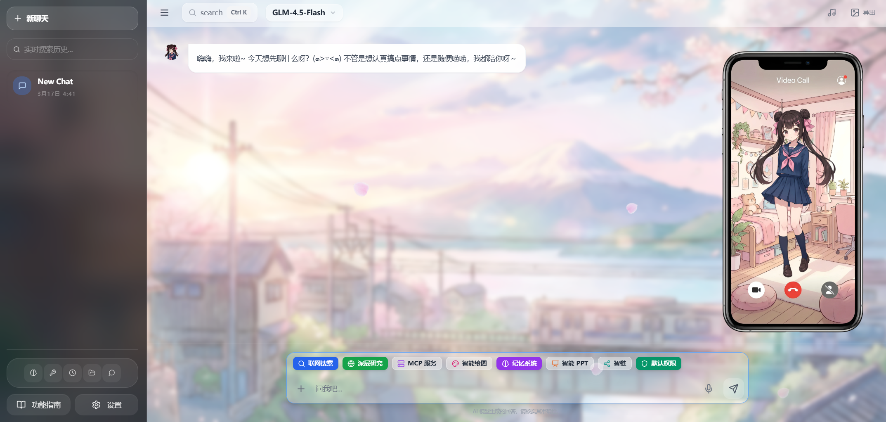

<div align="center">

# Saki AI Agent
### 本地 AI Agent框架 / 桌面级 AI 助手 / OpenClaw 替代方向

</div>

<div align="center">

[](https://nodejs.org/)
[](https://reactjs.org/)
[](https://vitejs.dev/)
[](https://tailwindcss.com/)
[](https://expressjs.com/)
[](LICENSE)
[](CONTRIBUTING.md)

</div>

Saki AI Agent 是一个面向中文用户的 **本地 AI Agent、开箱即用的桌面应用、Windows AI 助手**。它主打 **低门槛部署、低 Token 成本、低资源占用、默认更安全**：`2 hCPU / 200 MB` 可部署应用本体，`8B-12B` 小模型即可获得较好效果，推荐本地模型 `glm-4.7-flash`，并提供 **沙盒运行、敏感操作审批、文件回溯**。

> **关键词**：本地 AI Agent、OpenClaw 替代、Ollama、Windows AI 助手、桌面 AI 工作台、低资源部署、沙盒、安全、文件回溯



---

## 📖 项目定位：本地 AI Agent，解决 OpenClaw 在个人桌面场景的摩擦
2026 年是 Agent 爆发的年代，但普通用户真正用起来依然门槛不低：在线平台虽然方便，却有隐私顾虑、能力限制和持续的订阅/Token 成本；像 OpenClaw 这样的优秀项目虽然很强，却更偏 **self-hosted gateway / Agent runtime**，更适合开发者和极客用户，而不是只想在本地电脑上拥有一个好用 AI 助手的普通人。

<div style="color: #ff6f61; font-weight: bold; text-align: left; margin: 20px 0;">Saki AI Agent 的目标，就是把这些门槛降下来。</div>


它不是单纯的聊天窗口，而是运行在你本地电脑上的 **AI 副驾驶**：可以搜索网页、读取硬盘文档、调用本地绘图、连接语音和外部渠道。我们希望把前沿 AI 能力封装成一个 **温暖、易用、成本可控、安全默认值更高** 的桌面应用。

---

## 🆚 Saki AI Agent vs OpenClaw：平台层 vs 产品层

OpenClaw 是很强的 **self-hosted gateway / Agent 平台**，核心优势是多渠道接入、插件生态、多 Agent 路由和远程消息入口。  
**Saki AI Agent** 则更像一个面向中文用户、强调本地体验的 **桌面 AI 工作台**。

两者并不对立。OpenClaw 更偏“平台底座”，Saki 更偏“直接给人用的本地产品层”。如果你的目标是：

*   想在自己的电脑上低门槛部署一个 AI 助手
*   想优先使用本地模型，减少云端 Token 消耗
*   想要图形化配置、文件工作流、PPT/深度研究/记忆/第三方聊天一体化体验
*   想让安全策略默认更保守、更容易理解

那么 Saki 往往会比 OpenClaw 更合适。

| 维度 | Saki AI Agent | OpenClaw |
| --- | --- | --- |
| 产品定位 | 本地桌面 AI 工作台 | 多渠道 self-hosted gateway / Agent 平台 |
| 第一优先级 | 本地体验、中文交互、文件工作流、桌面可用性 | 渠道路由、远程接入、插件生态、多 Agent |
| 部署方式 | Windows 可直接双击 `start.bat` / `configure.bat` | 更偏 CLI / Gateway / Channel / Workspace 配置，Windows 场景通常还要 WSL2 |
| 模型策略 | 强调本地可用，`8B-12B` 小模型即可获得较好效果 | 官方更偏推荐 strongest latest-generation model，实际更容易依赖云端强模型 |
| 成本控制 | 适合长期本地常驻，目标是少烧 Token | 平台能力强，但在高质量使用场景下更容易带来持续 Token 成本 |
| 安全体验 | 默认权限模式、沙盒运行、敏感操作审批、文件回溯 | 安全能力完整，但更依赖操作者理解并正确配置 trust boundary、allowlist、tool policy、sandbox |
| 适合谁 | 普通用户、独立开发者、创作者、轻量办公/研究场景 | 开发者、极客用户、重度多渠道/远程接入场景 |

---

## 😖 OpenClaw 痛点：上手、Token、桌面体验、安全配置

这里说的“痛点”不是指 OpenClaw 不强，而是它<span style="color: #ff6f61; font-weight: bold; text-align: left; margin: 20px 0;">在普通用户的个人桌面场景里</span>摩擦更大：

*   **上手门槛高**：要理解 gateway、agent、channel、workspace、skill、allowlist、tool policy 等整套概念。
*   **Windows 成本更高**：官方文档至今仍建议 Windows 通过 WSL2 使用，这对很多非开发者用户并不友好。
*   **容易烧 Token**：官方更倾向推荐“最强的最新代模型”保证质量和安全，这对平台合理，但对本地常驻个人助手来说长期成本更高。
*   **更像平台，不是现成桌面应用**：如果你要的是文件拖拽、图形化设置、记忆管理、PPT 生成、深度研究、消息内文件回溯，OpenClaw 往往还需要你自己再补一层产品。
*   **安全配置更吃经验**：OpenClaw 的安全能力很强，但要用得稳，操作者需要更清楚地理解信任边界、权限、沙盒和规则配置。

Saki 的目标不是否定 OpenClaw，而是<span style="color: #ff6f61; font-weight: bold; text-align: left; margin: 20px 0;">解决它在“本地个人桌面助手”这个场景下的这些现实摩擦</span>。

---

## 🎯 适合谁：Windows、本地模型、中文场景、隐私和安全敏感用户

*   **想在自己电脑上长期常驻一个 AI 助手的人**，而不是只想偶尔试一试 Agent。
*   **Windows 用户**，希望尽量少碰 WSL2、复杂 CLI 和多层配置。
*   **硬件和预算有限的人**，希望用 `8B-12B` 的本地小模型也能获得比较好的体验。
*   **重视隐私的人**，希望文档、会话、记忆尽量留在本地。
*   **需要中文体验的人**，尤其是办公、研究、PPT、文档分析、QQ 接入这类高频中文场景。
*   **对安全更敏感的人**，希望系统默认更保守，而不是默认给 Agent 更大的自由度。

---

## 🏆 核心优势：2 hCPU / 200 MB、8B-12B本地模型、安全沙盒

### 1. 轻量部署

Saki 的 **应用本体** 足够轻。对于基础 Web/API 服务，`2 hCPU`、`200 MB` 运行内存级别即可完成部署。  
也就是说，你不需要先准备一台“重型 AI 服务器”，就能把桌面 Agent 系统先跑起来。

> **注意**：这里的 `2 hCPU / 200 MB` 指的是本项目自身的应用服务开销；如果你还要在同一台机器上运行 Ollama、Stable Diffusion、GPT-SoVITS 等模型服务，模型本身仍然需要额外的 CPU / RAM / 显存。

### 2. 小模型也能打

Saki 不是按“必须上最强云端模型”设计的，而是按“**本地小模型也要可用**”优化体验。  
在实际使用中，`8B-12B` 的小模型已经可以覆盖大量本地助手场景，做到：

*   日常对话
*   文档阅读与问答
*   简单联网检索与总结
*   代码辅助
*   基础任务规划

本项目目前最推荐的本地模型路线是 **`glm-4.7-flash`**。  
它在中文理解、速度、性价比和日常可用性之间平衡很好，适合长期本地部署，也更适合解决 OpenClaw 常见的“强依赖云端模型、Token 成本越用越高”的问题。

### 3. 安全默认值更高

除了成本，另一个核心问题是安全。Saki 在设计上更强调 **默认保守**：

*   **沙盒运行**：默认权限模式下，终端和文件工具被限制在沙盒范围内运行。
*   **敏感操作审批**：覆盖、编辑、删除文件，以及高风险终端命令，会先暂停并请求用户确认。
*   **文件回溯**：AI 造成的文件修改可以回滚，误改、误删后更容易恢复。
*   **本地优先**：尽量把数据、文件和工作流留在你的本机，而不是丢给第三方 SaaS。

这意味着<span style="color: #ff6f61; font-weight: bold; text-align: left; margin: 20px 0;">它不仅更省钱，也更适合作为长期放在个人电脑上的本地 Agent</span>。

---

## ✨ 核心功能深度解析

### 1. 💬 更有“灵魂”的对话体验
*   **多模型支持**：无缝对接 **Ollama**（本地运行 Qwen3、GLM 等）、Lmstudio、GitHub Copilot 以及 OpenAI / DeepSeek / 智谱 / Gemini / MiniMax / Anthropic / Moonshot / 通义千问 / 豆包 / 自定义 OpenAI 兼容 API。
*   **每个渠道独立 API Key**：不同云端服务的 Key 分开保存，不再共用同一个 API Key；也可以开启“显示全部已启用 API 模型”，在顶部模型列表里直接看到所有已配置渠道的模型。
*   **情感化人格 (Saki)**：她不是冷冰冰的问答机器。她会开心、会害羞、会思考。系统内置丰富的情感表情包和语气系统，聊天更像在和真人朋友交流。
*   **深度思维可视化**：对于支持“思维链”的模型（如 QAQ、Gemma3），Saki 会优雅地展示 `<UserThinking>` 过程，让你看到 AI 思考的逻辑转折。

### 2. 📂 强大的本地文档分析
直接把文件拖进聊天框，即可开始对话。底层解析引擎支持：
*   **PDF**：智能提取文本，保留段落结构。
*   **Word / Excel / PPT**：兼容 Office 三件套，通过 `mammoth` 和 `officeparser` 深度还原文档内容。
*   **长文档切片**：自动将几万字长文切分为 AI 可理解的小块，实现精准问答。

### 3. 🌐 智能联网与自主 Agent
*   **自主任务规划**：当你问“帮我查一下最近的 AI 新闻并总结”，Saki 会：1. 拆解任务 -> 2. 调用搜索工具 -> 3. 阅读网页内容 -> 4. 整理总结。
*   **混合搜索引擎**：集成 **Bing** 和 **SearxNG**，支持实时获取互联网最新信息。
*   **终端交互**：在你的授权下，它可以执行 PowerShell / Shell 命令来获取系统状态、运行脚本或处理文件。终端工具默认超时已扩展到更适合大型任务的时间，并支持为单次命令指定超时时间，`0` 表示不自动超时，适合大型下载或本地模型任务。
*   **企业级 MCP 宿主**：支持 Model Context Protocol，可动态加载本地或远程 MCP 服务器（如 Google Maps、GitHub、SQLite 等），扩展 AI 能力。
*   **长上下文自动压缩**：会话很长时，后端会保留最近关键上下文，并把更早的工具调用和对话压缩成背景摘要，减少无意义 Token 消耗。

### 4. 🎨 🎙️ 视听全感官交互与多端接入
*   **本地绘图 (Stable Diffusion)**：直接调用本地 SD WebUI 生成高质量图像。
*   **情感语音 (GPT-SoVITS)**：接入开源语音克隆模型 GPT-SoVITS，Saki 能用更逼真的语气念出回复，甚至包含叹气、笑声等细节。
*   **多端 AI 桥接 (QQBot)**：内置 `qqBridge` 逻辑，支持将 Saki 的能力一键接入 QQ 频道或群聊，并支持 `/deep` 深度搜索、`/ppt` 报告生成等高级指令自定义。

### 5. 🥃 故事杯 Story Glass
*   **语音讲故事**：打开故事杯页面后，可以直接对 Saki 讲故事。Saki 会先倾听和回应，而不是每句话都立刻生成结果。
*   **智能判断“该不该调酒”**：后端会结合故事长度、情绪线、画面感和用户偏好判断是否已经适合生成一杯“故事杯”。
*   **故事酒卡**：生成结果会包含鸡尾酒名、风味、杯型、故事摘要、精选引语、图像/插画和分享卡。
*   **故事杯架**：已生成的故事杯可以在页面中回看、收藏、筛选、分享或下载酒卡。
*   **沉浸式动效**：新增调酒、聆听、思考、上杯等视频状态，以及风味信号、暖度杯等视觉反馈。

### 6. 🧩 Skills 技能系统
*   **本地 Skills 管理**：可以查看、启停、编辑和删除非保护的本地 Skill。
*   **OpenHub 技能搜索与安装**：支持先搜索远程 Skill、预览 `SKILL.md`，再决定是否安装到本地。
*   **更省 Token 的 Skill 读取**：AI 现在可以用中文显示名、稳定 key/slug，或标题片段直接读取 Skill；例如 `张雪峰.skill - 教育与思维操作系统` 会自动匹配到 `zhangxuefeng-perspective`，不需要反复搜索 slug。

### 7. 🧾 深度研究、PPT 与可信度核验
*   **深度研究**：联网检索多篇资料，展示研究过程，并生成可阅读的综合报告。
*   **PPT 生成**：把主题快速整理成演示结构，支持专注查看和导出。
*   **智链可信度核验**：适合核验明确主张，会展示证据来源、支持/反驳关系和最终可信度判断。

---

## 🛠️ 技术亮点 (Technical Highlights)

### 🚀 混合动力爬虫引擎
内置基于 **Puppeteer** 与 **Cheerio** 的双模态爬虫。支持 JS 动态渲染、模拟真实用户滚动加载、智能正文提取（自动剔除广告与导航），尽量拿到干净网页信息。

### 📄 全格式文档深度解析
集成专业级解析链，涵盖 PDF、现代 Office（`.docx`、`.xlsx`、`.pptx`）以及旧版 Word（`.doc`）。通过多层文本提取技术，还原复杂文档结构。

### 🔌 健壮的 MCP 运行环境
针对 Windows 深度优化 `npx.cmd` 调用流，具备 **15 秒智能连接超时监控** 与非标准 JSON 输出自动诊断能力，确保 MCP 插件运行稳定。

### 🌊 双流输出与智能路由
支持 **思维链 (Reasoning)** 与 **最终答案 (Text)** 的并行流式传输。后端还内置针对 GitHub Copilot API 的多级 Fallback 机制，确保在复杂网络环境下也能尽快响应。

### 🛡️ 默认安全护栏
默认权限模式下，终端与文件工具会被限制在沙盒中；对覆盖、编辑、删除等敏感操作，系统会暂停并请求用户确认；对于 AI 生成或修改过的文件，还内置了文件回溯逻辑，显著降低误操作风险。

### 🧠 更加懂你的记忆功能
使用LightMem方案记忆，在“效果”和“效率”之间找到平衡。在不牺牲准确率的前提下，把Token、API调用次数和运行时间都压到最低，适合长期本地部署的个人助手。

---

## 🚀 极速上手指南

### 环境要求
*   **操作系统**：Windows 10/11（推荐）、macOS、Linux
*   **Runtime**：[Node.js](https://nodejs.org/)（v18 或更高版本）

> **轻量部署说明**：Saki 的 Web/API 服务本体可在 `2 hCPU`、`200 MB` 运行内存级别完成基础部署。若同机运行 Ollama、Stable Diffusion、GPT-SoVITS 等模型服务，额外资源需求以这些模型服务本身为准。

### 1. Windows 启动
无论是初次安装还是日常使用，你只需要做这一步：

1.  找到根目录下的 **`start.bat`** 文件。
2.  **双击运行**。
    *   脚本会自动检查环境。
    *   自动安装前端（`frontend/`）和后端（`backend/`）依赖。
    *   自动同时启动 Web 服务和 API 服务。
3.  浏览器打开 `http://localhost:5432`。

> 若在局域网或者公网内其他设备访问，请使用 `http://<你的IP地址>:5432`，并确保防火墙放行 5432 端口。

### 2. macOS/Linux 启动
1.  打开终端，进入项目根目录。
2.  运行以下命令：
    ```bash
    chmod +x deploy.sh
    ./deploy.sh
    ```

> 第一次运行安装依赖可能需要几分钟，请看到“服务已停止”之前不要关闭窗口。

### 3. Windows 配置向导
如果你想一步步配置模型、搜索、绘图、TTS、QQBot，以及 Windows 自启动策略，可以直接运行：

1.  双击根目录下的 **`configure.bat`**。
2.  或者在终端中运行：
    ```bash
    npm run configure
    ```
3.  向导会逐步询问关键配置项。
    *   每一步都可以选择 **Skip**。
    *   文本输入中，直接回车表示保留当前值。
    *   输入 `-` 可以清空当前值。
4.  自启动支持以下策略：
    *   关闭自启动
    *   启动文件夹
    *   Windows 计划任务

> 当然，你也可以直接跳过配置向导，在设置界面修改这些配置项。

---

## ⚙️ 高级功能配置手册

想要解锁“完全体”Saki？请配合以下工具使用。

### 🔍 配置 Ollama 模型
Saki 原生支持通过 Ollama 连接本地运行的各种语言模型（如 Gamma3、Qwen3、GLM 系列等）。本项目更推荐优先走 **本地小模型路线**：`8B-12B` 的模型在这里就能达到较好的中文助理效果，目前首推 **`glm-4.7-flash`**。这样既能保证日常体验，也能显著降低对云端强模型的依赖，减少长期使用中的 Token 消耗。只需在 Ollama 中创建模型实例，并在 Saki 设置中输入正确的 URL 即可（本地部署的 Ollama 端口通常为 `http://127.0.0.1:11434`）。

### 🔑 配置云端 API 与模型列表
如果你更想使用云端模型，Saki 支持把不同渠道的 API Key 分开保存：

*   OpenAI
*   DeepSeek
*   智谱
*   Gemini
*   MiniMax
*   Anthropic
*   Moonshot / Kimi
*   通义千问
*   豆包
*   自定义 OpenAI 兼容接口

在设置界面中填写对应渠道的 Key 后，Saki 会按当前选中的渠道拉取模型列表。
如果开启 **显示全部已启用 API 模型**，顶部模型选择器会把所有已配置 Key 的渠道模型一起列出来，方便在不同服务之间快速切换。

> 真实 Key 会保存在本地的 `data/global_config.json` 中，该文件默认不会提交到 Git。仓库里只保留 `data/global_config.example.json` 作为空白示例。

### 🎨 配置 Stable Diffusion (AI 绘图)
如果你想让 Saki 原生支持画图，需要连接到你的本地 SD WebUI。

1.  **准备环境**：确保你已安装 Stable Diffusion WebUI（Automatic1111 或 Forge 版本，可直接使用绘世整合包启动）。
2.  **开启 API 模式**：
    *   找到 SD 目录下的 `webui-user.bat`。
    *   编辑该文件，在 `COMMANDLINE_ARGS` 一行添加 `--api`。
    *   示例：`set COMMANDLINE_ARGS=--api --xformers --theme dark`

（若使用绘世整合包，需要打开“高级选项-监听设置-开放远程连接”的开关）

3.  **启动 SD**：运行 `webui-user.bat`。
4.  **Saki 设置**：在本项目网页左下角设置中，默认 SD URL 为 `http://127.0.0.1:7860`。

> 当然，你也可以买一个生图的API，在设置里把 URL 换成对应的 API 地址和密钥即可，超省事。

### 🗣️ 配置 GPT-SoVITS (AI 语音)
如果主机/服务器性能较好，可以让 Saki 用声音和你交流。GPT-SoVITS 是目前很强的开源语音克隆模型，能模仿各种声音说话。

1.  **准备环境**：下载并解压 [GPT-SoVITS](https://github.com/RVC-Boss/GPT-SoVITS) 整合包。
2.  **启动命令**：
    *   进入 GPT-SoVITS 根目录。
    *   在地址栏输入 `cmd` 回车打开终端。
    *   输入并运行以下命令：
        ```cmd
        runtime\python.exe api_v2.py -a 127.0.0.1 -p 9880
        ```
    *   *(注：端口 9880 是 V2 版本的默认 API 端口)*
3.  **Saki 设置**：
    *   进入设置 -> TTS 设置。
    *   开启功能，并上传一段几秒钟的 **参考音频**（你希望 Saki 模仿的声音）及其对应的 **参考文本**。

### ⏱️ Agent 终端长任务
Agent 的终端工具现在更适合处理大型下载、模型运行和长时间脚本：

*   默认终端超时时间更长，避免 90 秒就中断大型任务。
*   单次工具调用可以传入 `timeoutSeconds`。
*   `timeoutSeconds = 0` 表示不自动超时。
*   对需要长期运行的服务或模型，推荐让 AI 使用 `Start-Process` 或 `Start-Job` 后台启动，这样当前对话不会被一个常驻进程卡住。

---

## 🛠️ 技术栈与架构 (Under the Hood)

本项目采用现代化前后端分离架构，代码结构清晰，便于二次开发。

### 🖥️ 前端 (Frontend)
*   **Framework**：[React 18](https://react.dev/) - 组件化构建，响应迅速。
*   **Build Tool**：[Vite 5](https://vitejs.dev/) - 秒级热更新，开发体验好。
*   **Styling**：[Tailwind CSS](https://tailwindcss.com/) - 原子化 CSS，设计美观且易于定制。
*   **State Management**：React Context + Hooks。
*   **Visuals**：`framer-motion`（动画）、`lucide-react`（图标）。

### 🔙 后端 (Backend)
*   **Runtime**：[Node.js](https://nodejs.org/) & [Express](https://expressjs.com/)。
*   **Core Services**：
    *   `services/mcp.js`：模型上下文协议管理。
    *   `services/taskScheduler.js`：自主 Agent 任务规划与分发中心。
    *   `services/parser.js`：统一文档解析层（PDF、Docx、Xlsx 等）。
    *   `services/crawler.js`：基于 Puppeteer 和 Cheerio 的网页爬虫。
*   **Data Storage**：本地 JSON 文件存储（位于 `data/` 目录），无需安装 MySQL/MongoDB，真正做到数据隐私与便携。

---

## ❓ 常见问题 (FAQ)

**Q: 为什么启动后浏览器无法连接？**  
A: 请检查终端窗口是否有报错。通常是因为 5431（后端）或 5432（前端）端口被占用，或者防火墙未放行。尝试关闭其他进程或开放防火墙端口再试。

**Q: 如何切换模型？**
A: 配置好对应模型服务后，会自动在顶部显示可选模型。选择后保存，Saki 会自动切换。如果你填了多个云端 API Key，可以在设置里开启“显示全部已启用 API 模型”，顶部列表会同时展示所有已启用渠道的模型。

**Q: 云端 API Key 会不会被上传到 GitHub？**
A: 不会。真实配置保存在 `data/global_config.json`，默认被 `.gitignore` 排除；仓库只提供空白的 `data/global_config.example.json`。

**Q: 为什么 AI 读 Skill 时不用再反复搜索 slug？**
A: Skill 读取现在支持显示名、slug 和标题片段的宽松匹配。比如中文结果标题、`.skill - ...` 形式的名字，也能直接解析到对应的已安装 Skill。

**Q: 大型下载或本地模型任务还会 90 秒超时吗？**
A: 终端工具已经改成更长的默认超时，并支持单次指定 `timeoutSeconds`；传 `0` 可以关闭自动超时。常驻服务建议用后台进程启动。

**Q: 如何更换 Saki 的人设？**  
A: 点击左下角设置 -> 个性化 -> `System Prompt`。你可以随意修改提示词，让她变成严谨的教授，或是活泼的导游。

---

## 🤝 参与贡献

Saki AI Agent 是一个开源项目，我们非常欢迎贡献：

1.  **Fork** 本仓库。
2.  创建你的特性分支：`git checkout -b feature/NewFeature`
3.  提交更改：`git commit -m 'Add some feature'`
4.  推送到分支：`git push origin feature/NewFeature`
5.  提交 Pull Request。

无论是修复一个小 Bug，还是增加一个新的 Agent 能力，我们都欢迎。

---

<p align="center">Best wishes for your journey with Saki AI Agent!</p>
